<!-- animated contribution heatmap: real data, cells sweep in left to right.
     regenerated daily by .github/workflows/update-profile-art.yml -->

<h3><code>parth@github ~ $ ./contributions.sh</code></h3>

 
 

<!-- ASCII portrait that types itself in, next to a neofetch-style card.
     regenerate: python scripts/prep_photo.py assets/source-photo.jpg
              && python scripts/make_portrait.py --cols 116
              && python scripts/make_info_card.py --width 448 -->

<h3><code>parth@github ~ $ whoami</code></h3>

<table>
<tr>
<td valign="top"></td>
<td valign="top"></td>
</tr>
</table>

 

<h3><code>parth@github ~ $ ./links.sh</code></h3>

 

Student. Building things in applied ML — mostly around perception, detection, and learning physical systems from data.

---

## From-scratch ML foundations

Five repos, one rule: the core written out by hand, every non-obvious claim
checked against a closed form or an independent oracle, and limitations stated
rather than buried. **1,337 tests, 89 committed figures, ~54k lines of Python**
across the five, all CI-green and reproducible from a fresh clone.

| Repo | The result I would point at first | tests |
|---|---|---|
| [**mcmc-from-scratch**](https://github.com/porth-bot/mcmc-from-scratch) `v1.1` | On Neal's funnel, split R-hat reports "converged" while the sampler is measurably biased. The non-centering that fixes it is in the same repo. | 187 |
| [**grokking-transformer**](https://github.com/porth-bot/grokking-transformer) `v1.1` | The generalizing circuit is already forming underneath the memorization: 98% of logit energy on the a+b diagonal after grokking, 12% before, while test accuracy has not moved. | 134 |
| [**gp-from-scratch**](https://github.com/porth-bot/gp-from-scratch) `v1.1` | Random features starve the error bar in a data gap: exact posterior sd 0.97, median random-feature draw 0.505, while inducing points hold it at matched cost. Also: `np.linalg.solve(L, B)` is not a triangular solve, and fixing that took an n=16,000 fit from 57.9 s to 12.3 s. | 340 |
| [**pinn-from-scratch**](https://github.com/porth-bot/pinn-from-scratch) `v1.1` | The high-dimensional crossover where a PINN should beat a mesh is real and computable, and the network's accuracy dies 6 to 15 dimensions before it arrives. | 395 |
| [**diffusion-from-scratch**](https://github.com/porth-bot/diffusion-from-scratch) | Annealed Langevin with a learned score gets measurably *worse* with 10× the compute, because an equilibrium sampler converges harder to the biased law it was handed. | 281 |

[**porth-bot/mcmc-from-scratch**](https://github.com/porth-bot/mcmc-from-scratch) — Metropolis–Hastings, Gibbs, HMC, MALA, NUTS and parallel tempering in pure NumPy. No claim without a ground truth or a cross-check: hand-derived gradients against finite differences, sampler moments against closed-form posteriors, the ESS estimator against an AR(1) closed form. The stochastic-gradient samplers get the same treatment and produce the same kind of answer — SGHMC's friction correction is worth 2–9× SGLD's effective samples per gradient at matched bias, and is *unaffordable* on the repo's own BNN posterior, because the stability condition works out to a step size below 4.3e-4 with no property of the target in it. Annealed importance sampling gives the sharpest version: on a target whose initial distribution misses a mode, the estimate is short by exactly the log of the missed weight while the ESS diagnostic reads a perfect 1.000. Full derivations in `theory/derivations.md`, CI-tested.

[**porth-bot/grokking-transformer**](https://github.com/porth-bot/grokking-transformer) — a transformer written from the attention up, trained on modular arithmetic until it groks: memorizes at step 100, sits near 20% test accuracy for ~1,300 steps with the training loss already flat, then jumps to 100%. The repo is about what *controls* that delay and what changes inside. Weight decay decides whether it happens at all, data fraction decides when, and every sweep carries medians and bands over five seeds rather than one lucky run. The mechanistic half reads the trained model directly: the embeddings bend into a ring, and a 2D Fourier transform of the logits shows the generalizing solution is a sparse sum over a handful of frequencies. Two results I like better than the headline — grokking buys the symmetry *the operation actually has* rather than commutativity (subtraction's anti-equivariance defect falls to 0.271 while its invariance defect rises to the no-symmetry level, because a subtraction model must order its operands), and one wide attention head groks about 4× sooner than four narrow ones at identical parameter count, with the five seeds completely separated.

[**porth-bot/gp-from-scratch**](https://github.com/porth-bot/gp-from-scratch) — Gaussian process regression in pure NumPy: kernels with hand-derived, finite-difference-checked gradients, marginal-likelihood optimization, a calibration study, a Mauna Loa CO₂ forecast, and the neural-tangent-kernel correspondence measured as a from-scratch wide ReLU network converges to its analytic GP limit. Sparse GPs are here too, derived rather than cited: the Titsias variational bound with gradients through the *inducing locations*, FITC as one flag on the same code so the comparison is honest, and the measured pathology that follows. Two honestly-reported negatives it would have been easier to leave out: ML-II raises the CO₂ evidence but extrapolates *worse* than the hand-set prior, and when a medium-term kernel term fixes the trend, the control shows a plain RBF in the same slot does it just as well, so the scale mixture was never the mechanism.

[**porth-bot/pinn-from-scratch**](https://github.com/porth-bot/pinn-from-scratch) — physics-informed neural networks built from the derivatives up, in PyTorch. The PDE residual comes from exact autograd derivatives of the network, and every problem is measured against a ground truth that is never a grid solver: the heat equation against its exact Fourier series, Burgers' against Cole-Hopf evaluated by Gauss-Hermite quadrature. The repo leads with the honest part, which is that classical solvers win decisively at low dimension. The high-dimensional study is the counterweight and it did not go the way the plan expected: the mesh does become exponentially expensive, the crossover *is* computable, and the network stops reaching the accuracy target 6 to 15 dimensions before the crossover arrives. Then the control that reframes it — replace the physics loss with supervised regression onto the exact solution and the gap closes to 12% at d=8, so most of the failure was never about PINNs at all, it was a width-128 tanh network failing to represent a concentrated target.

[**porth-bot/diffusion-from-scratch**](https://github.com/porth-bot/diffusion-from-scratch) — score-based generative modeling built from the score outward, in PyTorch, on 2D targets whose scores are known in **closed form**. That is the whole design: a Gaussian mixture stays a Gaussian mixture when noised, so a learned score can be reported as an error against truth at every noise level, and every sampler can be run with the *exact* score as a control, which separates score-estimation error from discretization error. Neither check exists on an image dataset. What it buys: the training loss turns out to be useless as a stopping signal while the true score error still falls 4.5×; refining the sampler closes discretization error and leaves estimation error untouched; variance-exploding and variance-preserving diffusion turn out to be one chain in two coordinate systems, agreeing pathwise to 1e-11; and on a well-separated mixture, classifier-free guidance's tilt provably does nothing to the target distribution while the one-pass sampler drifts anyway, which puts the blame on the sampler rather than the folklore.

They lean on each other where the math actually overlaps. The NTK derived in `gp-from-scratch` is what explains `pinn-from-scratch`'s spectral bias; `mcmc-from-scratch` samples the finite-width weight posterior that the same NTK section solves in closed form at infinite width; and `diffusion-from-scratch`'s Langevin sampler is `mcmc-from-scratch`'s MALA proposal with the accept step deleted, a deletion that is forced rather than chosen, because a learned score gives no density to put in a Metropolis ratio.

---

## Also here

[**porth-bot/bodymaps-viewer**](https://github.com/porth-bot/bodymaps-viewer) — a browser-native CT and segmentation viewer: NIfTI parsing, multiplanar reformatting, volume raycasting and organ surface reconstruction in raw WebGL2, with no plugins, no server and no dependencies. [Live here](https://porth-bot.github.io/bodymaps-viewer/).

[**porth-bot/keystone**](https://github.com/porth-bot/keystone) — a Bayesian diagnostic engine for calculus tutoring: finds the prerequisite skill under a student's mistakes, reteaches that exact gap, and verifies the fix moved mastery. Built with Joseph David for the Prometheus July AI Challenge.

[**porth-bot/deepscope**](https://github.com/porth-bot/deepscope) — a deepfake detection platform, and the project behind a 3rd Grand Award in Software Design at ISEF 2026. Three detectors in a weighted ensemble (CLIP for semantic mismatch, EfficientNet for texture artifacts, feature fusion for low-level statistics), because each one fails differently; Core ML on the Neural Engine with lazy loading and LRU eviction; optical-flow temporal consistency for the video fakes whose individual frames all look plausible. FastAPI and Next.js, Grad-CAM heatmaps so the verdict is not a black box. The design decision I still like: the system is allowed to return low confidence, which a lot of the detection literature treats as failure and I think is the only honest output for an ambiguous frame.

---

The art on this page is generated by the scripts in [`scripts/`](scripts/) (photo prep, ASCII portrait, contribution heatmap, info card) and refreshed daily by a workflow. Details in each script's docstring.
